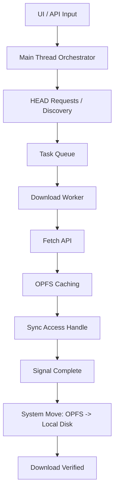
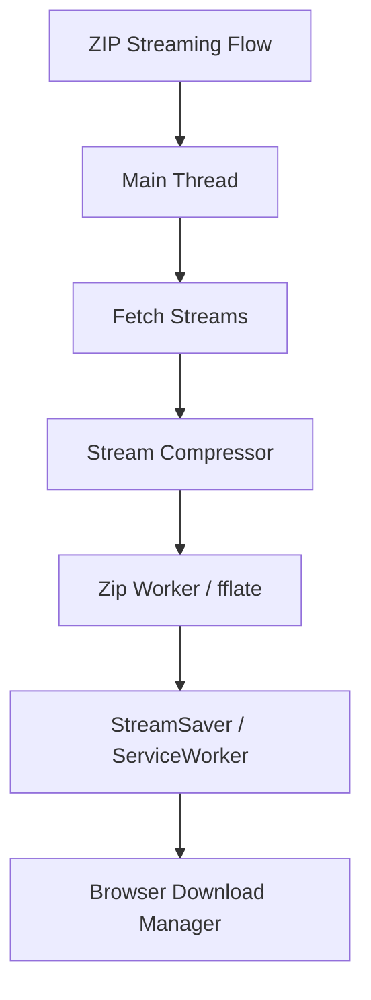

# BNT High-Performance Browser Downloader

A modern, high-throughput batch download manager for the browser. This project is designed to handle multi-gigabyte files and large batches by utilizing advanced Web APIs to bypass traditional browser memory limitations.

## 🚀 Key Features

- **Sequential & Parallel Downloads**: Intelligent queue management with customizable concurrency.
- **OPFS-to-Native Pipeline**: Utilizes the Origin Private File System (OPFS) as a high-speed synchronous cache (`createSyncAccessHandle`) before moving files to the user's selected directory via the File System Access API.
- **Streaming ZIP Fallback**: Seamlessly switches to a streaming ZIP archive (using `fflate` and `streamsaver`) for browsers that lack the File System Access API (Firefox, Safari).
- **Resumable Operations**: IndexedDB-backed state management allows the app to resume interrupted downloads after a page refresh or crash.
- **Backpressure Ready**: Implements custom backpressure logic in streams to prevent memory exhaustion (RAM spikes) when network speed outpaces write speed.
- **Zero-Copy Transfers**: Uses Transferables to move data between the main thread and Web Workers without memory overhead.

## 🏗️ Architecture Overview

The system is built on a "Worker-First" philosophy:

1.  **Main Thread**: Handles discovery (HEAD requests), UI updates, and orchestrates the worker queue.
2.  **Download Worker**: Performs the raw `fetch`. Writes chunks synchronously to OPFS using the high-performance `FileSystemSyncAccessHandle`.
3.  **Zip Worker**: Handles chunked compression for the streaming fallback path using `fflate`.
4.  **State Store**: A dedicated IndexedDB wrapper for persistence and resumability.

### Native Data Pipeline (Chrome/Edge)


### Fallback Data Pipeline (Firefox/Safari)


## 🛠️ Technology Stack

- **Foundations**: TypeScript, Vite
- **Storage**: IndexedDB (Persistence), OPFS (Caching)
- **APIs**: File System Access API, ReadableStreams, Web Workers
- **Libraries**: 
  - `fflate`: Ultra-fast compression.
  - `streamsaver`: Bridge for streaming downloads in legacy browsers.

## 🚦 Getting Started

### Prerequisites
- Node.js 18+
- A modern browser (Chrome 102+ recommended for native folder saving)

### Installation
```bash
npm install
```

### Development
```bash
npm run dev
```

### Build
```bash
npm run build
```

## 📝 Usage

1.  **API Fetch**: Enter an API endpoint that returns a JSON object with a `presignedUrls` array.
2.  **Manual Input**: Alternatively, paste a comma-separated list of direct URLs.
3.  **Directory Selection**: Pick a destination folder on your local machine.
4.  **Monitor**: Watch the progress bars navigate through the queue.

---

### Technical Limitations & Notes
- **Storage Quota**: Ensure your browser's persistent storage quota is at least 1.1x the size of your total download batch.
- **S3 Presigned URLs**: The system extracts filenames from the `X-Amz-*` query params automatically if available.
