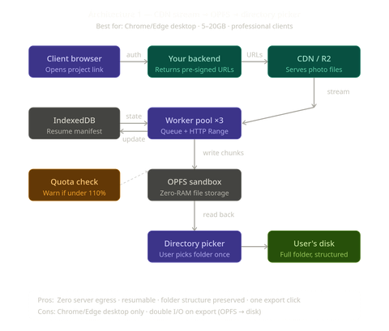
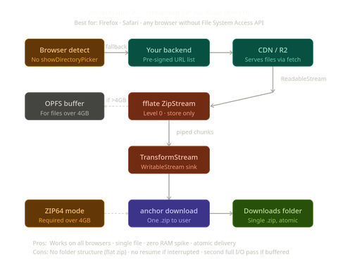

# BNT High-Performance Browser Downloader

Created by **Rochak Sulu**

A modern, high-throughput batch download manager for the browser. This project is designed to handle multi-gigabyte files and large batches by utilizing advanced Web APIs to bypass traditional browser memory limitations.

## 🚀 Key Features

- **Sequential & Parallel Downloads**: Intelligent queue management with customizable concurrency.
- **Two-Stage Staging Pipeline**:
    - **Stage 1 (OPFS Staging)**: High-speed multi-threaded downloads into the Origin Private File System using `FileSystemSyncAccessHandle` for maximum throughput.
    - **Stage 2 (Native Transfer)**: Seamless streaming of staged files from OPFS to the user's local directory via the File System Access API.
- **Native Folder preservation**: Recursively recreates complex relative folder structures on the local disk.
- **Robust Resumability**: IndexedDB-backed state management allows the app to resume interrupted downloads (at the byte level) after a page refresh or crash.
- **Smart Failover**: Automatic fallback to `HEAD` requests for diagnostic validation when standard `GET` requests fail.
- **Backpressure Ready**: Rigid physical buffer limits and read-pacing prevent memory exhaustion (RAM spikes) when network speed outpaces write speed.
- **Zero-Copy Transfers**: Uses Transferables to move data between the main thread and Web Workers without memory overhead.

## 🏗️ Architecture Overview

The system is built on a **Manager-Worker-Store** triad designed for maximum reliability:

1.  **Main Thread (Download Manager)**: Orchestrates the high-level state machine (Pending -> Staged -> Transferred), manages the directory handles, and handles UI reactivity.
2.  **Download Workers**: Perform raw data fetching. Utilize `FileSystemSyncAccessHandle` to write chunks synchronously to OPFS, bypassing the asynchronous main thread and IndexedDB bottlenecks.
3.  **Zip Worker**: Handles chunked compression for the streaming fallback path using `fflate` with built-in backpressure.
4.  **State Store**: A dedicated IndexedDB wrapper that holds progress metadata, allowing for persistent session resumption.

### The Staging Pipeline
Unlike traditional managers that write directly to the target disk (which can be slow or blocked), BNT utilizes **OPFS as a temporary staging area**. 
- Files are concurrently "staged" in OPFS.
- Once a file is fully staged, it is sequentially "transferred" (streamed) to the local disk.
- This ensures that heavy network activity never blocks the user-facing file system operations.

### Native Data Pipeline (Chrome/Edge)


### Fallback Data Pipeline (Firefox/Safari)


> [!NOTE]
> **Implementation Improvement**: While the fallback diagram mentions "no folder structure," the current codebase **does** preserve relative paths in the ZIP archive by prepending the `relativePath` to each file's path during the compression stage.


## 🛠️ Technology Stack

- **Foundations**: TypeScript, Vite
- **Storage**: IndexedDB (State persistence), OPFS (High-performance caching)
- **APIs**: 
  - **File System Access API**: For native directory writing.
  - **OPFS Sync I/O**: For low-latency data staging.
  - **ReadableStreams/WritableStreams**: For memory-efficient data transfer.
- **Libraries**: 
  - `fflate`: Ultra-fast compression.
  - `streamsaver`: Bridge for streaming downloads in browsers lacking File System Access.

## 🚦 Getting Started

### Prerequisites
- Node.js 18+
- A modern browser (Chrome 102+ recommended for native folder saving)

### Installation
```bash
npm install
```

### Development
```bash
npm run dev
```

### Build
```bash
npm run build
```

## 📝 Usage

1.  **API Fetch**: Enter an API endpoint that returns a JSON object with a `presignedUrls` array.
2.  **Manual Input**: Alternatively, paste a comma-separated list of direct URLs.
3.  **Directory Selection**: Pick a destination folder on your local machine.
4.  **Monitor**: Watch the progress bars navigate through the queue.

---

### Technical Limitations & Notes
- **Storage Quota**: Ensure your browser's persistent storage quota is at least 1.1x the size of your total download batch.
- **Auto-Cleanup**: The system automatically clears the IndexedDB manifest and local OPFS cache once all files have been successfully transferred to the local disk.
- **S3 Presigned URLs**: The system extracts filenames from the `X-Amz-*` query params automatically if available.
